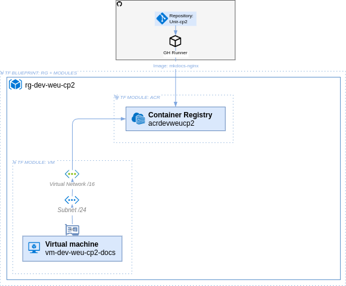

# Arquitectura

En esa sección se muestra


---

## Diagrama general

El siguiente diagrama representa la infraestructura desplegada con Terraform y configurada con Ansible, incluyendo una máquina virtual con un contenedor Podman y un clúster AKS, ambos obteniendo imágenes desde un Azure Container Registry (ACR).

{ .only-pdf }


*Figura 1: Diagrama de la arquitectura desplegada en Azure (Elaboración propia con [draw.io](./referencias.md#herramientas-usadas)).*
{ .cita }

## Componentes de la arquitectura

### Container registry

### Máquina virtual

La infraestructura de la máquina virtual se ha definido utilizando **Terraform**, organizando los recursos en módulos separados para mejorar la modularidad y reutilización del código. A continuación, se presentan los archivos principales que definen el despliegue:

- **[:material-file-document: `main.tf`](https://github.com/charlstown/unir-cp2/blob/main/terraform/modules/vm/main.tf)**: Contiene la definición de la máquina virtual, su interfaz de red y dirección IP pública.

- **[:material-file-document: `network.tf`](https://github.com/charlstown/unir-cp2/blob/main/terraform/modules/vm/network.tf)**: Define la red virtual (VNet) y la subred en la que se despliega la máquina virtual. 

- **[:material-file-document: `security.tf`](https://github.com/charlstown/unir-cp2/blob/main/terraform/modules/vm/security.tf)**: Especifica las reglas de seguridad mediante un Network Security Group (NSG), permitiendo el acceso SSH y tráfico HTTP/HTTPS.

- **[:material-file-document: `outputs.tf`](https://github.com/charlstown/unir-cp2/blob/main/terraform/modules/vm/outputs.tf)**: Define las salidas de Terraform, proporcionando información sobre la máquina virtual, como su ID y direcciones IP.

La infraestructura sigue un enfoque modular para facilitar la gestión y despliegue en diferentes entornos.

#### Definición de la Máquina Virtual

La máquina virtual está configurada en **Azure** utilizando **Terraform**, especificando los siguientes recursos:

```hcl
resource "azurerm_linux_virtual_machine" "vm" {
  name                  = var.vm_name
  resource_group_name   = var.resource_group
  location              = var.location
  size                  = var.vm_size
  admin_username        = var.admin_username
  network_interface_ids = [azurerm_network_interface.nic.id]

  admin_ssh_key {
    username   = var.admin_username
    public_key = var.ssh_public_key
  }

  os_disk {
    caching              = "ReadWrite"
    storage_account_type = "Standard_LRS"
  }

  source_image_reference {
    publisher = "Canonical"
    offer     = var.image_offer
    sku       = var.image_os
    version   = "latest"
  }
}
```

- Se ha elegido **Ubuntu 22.04 LTS (Gen2)** como sistema operativo, basado en la imagen oficial de **Canonical**.
- La máquina está configurada para autenticación por **clave SSH**, evitando contraseñas.
- Se asigna una **interfaz de red**, conectada a una **subred dentro de una VNet**.
- Se utiliza un disco gestionado con almacenamiento **Standard_LRS** para optimizar costes.

#### Configuración de Red y Seguridad

Se ha definido una **VNet y una subred** para la máquina virtual, con un **Security Group** que permite tráfico esencial:

```hcl
resource "azurerm_network_security_group" "vm_nsg" {
  name                = "${var.vm_name}-nsg"
  resource_group_name = var.resource_group
  location            = var.location
}

resource "azurerm_network_security_rule" "allow_ssh" {
  name                        = "Allow-SSH"
  priority                    = 1000
  direction                   = "Inbound"
  access                      = "Allow"
  protocol                    = "Tcp"
  destination_port_range      = "22"
  source_address_prefix       = "*"
  destination_address_prefix  = "*"
  network_security_group_name = azurerm_network_security_group.vm_nsg.name
}
```

- **SSH (22):** Permite el acceso remoto con claves SSH.
- **HTTP (80) y HTTPS (443):** Habilitados para servir contenido web.
- **Regla de salida:** Permite tráfico libre para actualizaciones y conexión a otros servicios.

#### Justificación de las Variables Definidas en `terraform.tfvars`

La configuración de variables permite personalizar la máquina virtual sin modificar el código principal. A continuación, se detallan las variables y su propósito:

| **Variable**          | **Valor**                     | **Justificación** |
|----------------------|-----------------------------|-------------------|
| `resource_group_name` | `"rg-weu-cp2"`              | Define el grupo de recursos para centralizar los servicios en Azure. |
| `location`           | `"West Europe"`             | Ubicación optimizada para latencia y costos. |
| `acr_name`          | `"acrweucp2"`               | Nombre del **Azure Container Registry** usado por VM y AKS. |
| `vm_name`           | `"vm-weu-cp2-docs"`         | Identificador de la máquina virtual. |
| `vm_username`       | `"charlstown"`              | Usuario administrador para acceso SSH. |
| `vm_size`          | `"Standard_B1ls"`           | Tamaño económico, suficiente para la carga de trabajo del ejercicio. |
| `ssh_public_key`   | `"~/.ssh/az_unir_rsa.pub"`  | Método seguro de autenticación sin contraseñas. |
| `vnet_name`        | `"vnet-weu-cp2"`            | Nombre de la VNet para gestionar la red interna. |
| `subnet_name`      | `"subnet-weu-cp2"`          | Subred específica dentro de la VNet. |
| `subnet_cidr`      | `"10.0.1.0/28"`             | Espacio de direcciones IP limitado para optimizar la asignación de recursos. |
| `image_os`         | `"22_04-lts-gen2"`          | Última versión LTS de Ubuntu, con soporte extendido. |
| `image_offer`      | `"0001-com-ubuntu-server-jammy"` | Identificador oficial de la imagen de Ubuntu en Azure Marketplace. |


### Kubernetes service

## Imágenes contenerizadas

### Imágen sin persistencia para la VM

La imagen utilizada en el contenedor Podman dentro de la máquina virtual se basa en **MkDocs**, una librería de documentación escrita en Python. Esta herramienta permite generar sitios estáticos a partir de archivos Markdown, facilitando la creación y publicación de documentación técnica [(MkDocs, s.f.)](./referencias.md#herramientas-usadas). La imagen generada en este ejercicio contiene la documentación del propio proyecto, asegurando que el contenido se pueda visualizar de manera estructurada en un navegador.

Además, se ha utilizado el tema **Material for MkDocs**, que añade una interfaz moderna y varias opciones de personalización [(Squidfunk, s.f.)](./referencias.md#herramientas-usadas).

#### Publicación en GitHub Pages  

La documentación también está disponible a través de **GitHub Pages**, lo que permite su acceso incluso cuando la infraestructura de Azure no está desplegada. Se puede visualizar en el siguiente enlace:  

[:material-file-document: Ver documentación en GitHub Pages](https://charlstown.github.io/unir-cp2/informe/despliegue/)  

#### Generación de la Imagen  

La imagen se genera a partir de la documentación escrita en MkDocs, transformándola en un sitio web estático y empaquetándola en un contenedor. Esta imagen se construye y publica mediante dos métodos:  

1. **Workflow de GitHub:** Se ha añadido un workflow en `.github/workflows` llamado [:material-file-document: `Publish docs to ACR`](https://github.com/charlstown/unir-cp2/blob/main/.github/workflows/publish-release.yml), que permite generar y publicar la imagen en el ACR. 

2. **Ejecución con Ansible:** Durante la configuración de la máquina virtual, Ansible ejecuta un playbook con el mismo proceso que el workflow de GitHub para generar y publicar la imagen en el ACR.

El proceso detallado de despliegue de la imagen puede consultarse en el siguiente apartado de esta memoria: [:material-file-document: Sección de Despliegue](./despliegue.md).

### Imágen con persistencia para el AKS
