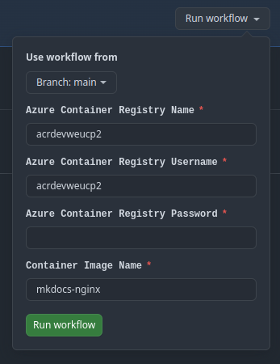
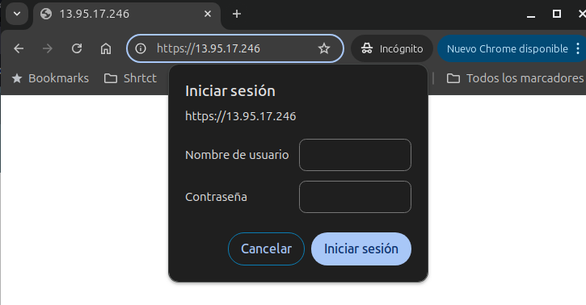

# Despliegue

A continuación, se explica cómo reproducir los pasos necesarios para llevar a cabo el caso práctico sobre el repositorio. Se detallan las instrucciones para:

- [1. Despliegue de la infraestructura](#1-despliegue-de-la-infraestructura)
- [2. Publicación de las imagenes](#2-publicacion-de-las-imagens)
- [3. Configuración de la VM](#3-configuracion-de-la-vm)
- [4. Configuración del AKS](#4-configuración-del-aks)

---

## 1. Despliegue de la infraestructura

El despliegue de la infraestructura se realiza con Terraform desde la máquina local, asegurando que la configuración es válida antes de aplicar los cambios y provisionar los recursos necesarios.

1. Accede al directorio de terraform en el repositorio e inicializa terraform.

    ```sh
    terraform -chdir=./terraform init
    ```
    Output: `Terraform has been successfully initialized!`

2. Ejecuta la validación de los ficheros generados con el siguiente comando:

    ```sh
    terraform validate
    ```
    output: `Success! The configuration is valid.`

3. Despliega la infraestructura con el siguiente comando, por defecto se despliega en dev. Siempre puedes añadir el flag `-var="environment=pro"` para especificar un entorno entre `dev|pre|pro`

    ```sh
    terraform -chdir=./terraform apply --auto-approve
    ```

!!! tip "Automatización de variables"

    Tras el despliegue de toda la infraestructura se generan automáticamente las variables globales necesarias para poder realizar lo que queda del ejercicio ejecutando el fichero `setup.sh`.

    ```sh
    source setup.sh
    ```

## 2. Publicación de las imagenes

La publicación de la imagen se automatiza mediante el workflow [`Publish release to ACR`](https://github.com/charlstown/unir-cp2/actions/workflows/publish-release.yml) de GitHub Actions, que envía la imagen al Azure Container Registry (ACR). Para ello, se deben proporcionar las credenciales adecuadas y validar la ejecución del proceso.

1. Rellenar los datos del formulario del workflow con username y pwd del ACR desplegado en Azure.

    ??? note "Visualizar usuario y contraseña del ACR"

        Siempre puedes ejecutar este comando para recuperar el usuario y la contraseña del ACR.

        ```bash
        az acr credential show --name acrweucp2dev --query "[username, passwords[0].value]" -o tsv
        ```

    

2. Ejecutar workflow y validar la correcta ejecución del job

    

## 3. Configuración de la VM

La configuración de la VM se llevará a cabo desde la máquina local utilizando Ansible, accediendo por SSH para realizar comprobaciones y garantizar el correcto despliegue del entorno.

1. Comprobar conexión a la VM por SSH

    ```sh
    ssh -i ~/.ssh/az_unir_rsa charlstown@${VM_IP}
    exit
    ```

2. Ejecutar ansible apuntando a la VM. Asegurarse que el comando se ejecuta desde `./ansible`. Para forzar ansible a recrear todo desde el principio es posible usar los argumentos `--force-handlers` y `--extra-vars "recreate=true"`.

    ```sh
    ansible-playbook ansible/playbook.yml -i ansible/hosts.yml --extra-vars "@ansible/vars.yml" --ask-vault-pass
    ```

    Este playbook se ejecuta apuntando a un Vault de ansible donde se han guardado las credenciales usadas para crear el fichero `htpasswd.users` en la carpeta `/etc/nginx/auth/htpasswd.users` de la VM.

    ??? note "Mostrar contraseñas guardadas en el vault"

        Para visualizar las contraseñas guardadas en el vault puedes ejecutar el comando:
        ```sh
        ansible-vault view secrets.yml
        ```

4. Si todo ha ido bien se puede comprobar que el sitio se muestra a través de internet en la ip pública de la VM. Ejecutando el comando:

    ```sh
     curl -k -u charlstown:\*\*\* https://${VM_IP}:443
    ```

    También puede visualizarse en el browser en la dirección `https://ip-publica/`.

    


## 4. Configuración del AKS


??? note "Descargar credenciales en local"

    El siguiente comando guarda las credenciales del AKS en `/home/<USER>/.kube/config` y marca como contexto el AKS seleccionado.

    ```sh
    az aks get-credentials --resource-group rg-weu-cp2-dev --name aks-weu-cp2-dev
    ```