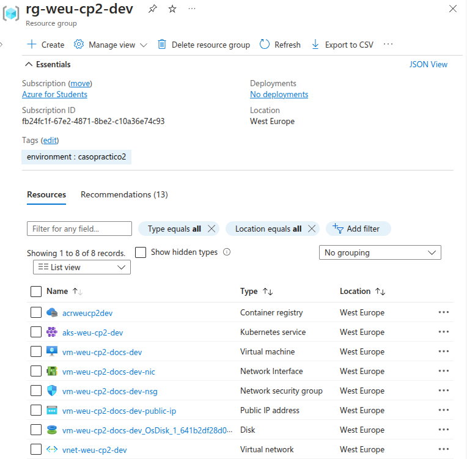
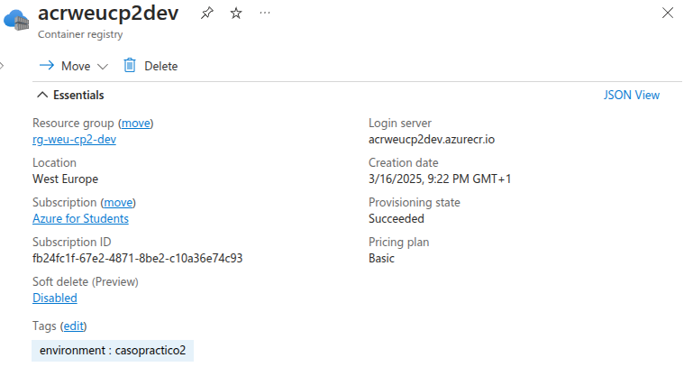
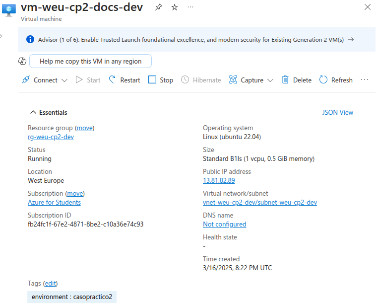
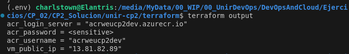
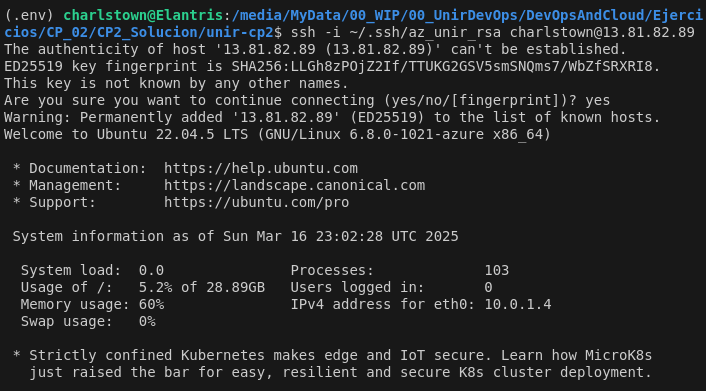
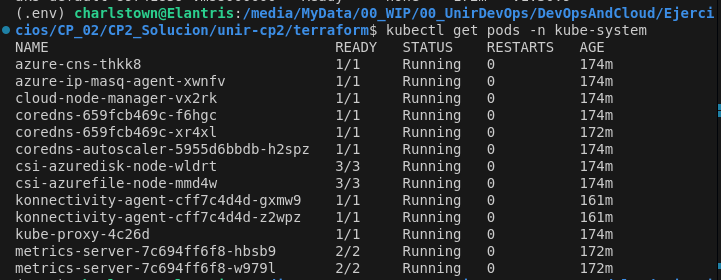

# Evidencias

A continuación, se exponen las evidencias de los procesos empleados para realizar la práctica.

- [1. Despliegue de la infraestructura](#despliegue-de-la-infraestructura)
- [2. Publicación de las imagenes](#publicacion-de-las-imagenes)
- [3. Despliegue en la VM](#despliegue-en-la-vm)
- [4. Despliegue en el AKS](#despliegue-en-el-aks)

---

## Despliegue de la infraestructura

En esta sección se muestran los logs los principales comandos ejecutados y algunas capturas que demuestran la correcta ejecución del caso práctico.

Lanzamos un `terraform plan` para comprobar todos los recursos.

```sh
terraform -chdir=./terraform plan
```

```bash title="output"
Terraform used the selected providers to generate the following execution plan.
Resource actions are indicated with the following symbols:
  + create

Terraform will perform the following actions:

  # local_file.ansible_inventory will be created
  + resource "local_file" "ansible_inventory" {
      + content              = (sensitive value)
      + content_base64sha256 = (known after apply)
      + content_base64sha512 = (known after apply)
      + content_md5          = (known after apply)
      + content_sha1         = (known after apply)
      + content_sha256       = (known after apply)
      + content_sha512       = (known after apply)
      + directory_permission = "0777"
      + file_permission      = "0777"
      + filename             = "../ansible/hosts.yml"
      + id                   = (known after apply)
    }

  # module.aks.azurerm_kubernetes_cluster.aks will be created
  + resource "azurerm_kubernetes_cluster" "aks" {
      + api_server_authorized_ip_ranges     = (known after apply)
      + current_kubernetes_version          = (known after apply)
      + dns_prefix                          = "aksweucp2"
      + fqdn                                = (known after apply)
      + http_application_routing_zone_name  = (known after apply)
      + id                                  = (known after apply)
      + image_cleaner_enabled               = false
      + image_cleaner_interval_hours        = 48
      + kube_admin_config                   = (sensitive value)
      + kube_admin_config_raw               = (sensitive value)
      + kube_config                         = (sensitive value)
      + kube_config_raw                     = (sensitive value)
      + kubernetes_version                  = (known after apply)
      + location                            = "westeurope"
      + name                                = "aks-weu-cp2-dev"
      + node_resource_group                 = (known after apply)
      + node_resource_group_id              = (known after apply)
      + oidc_issuer_url                     = (known after apply)
      + portal_fqdn                         = (known after apply)
      + private_cluster_enabled             = false
      + private_cluster_public_fqdn_enabled = false
      + private_dns_zone_id                 = (known after apply)
      + private_fqdn                        = (known after apply)
      + public_network_access_enabled       = true
      + resource_group_name                 = "rg-weu-cp2-dev"
      + role_based_access_control_enabled   = true
      + run_command_enabled                 = true
      + sku_tier                            = "Standard"
      + support_plan                        = "KubernetesOfficial"
      + tags                                = {
          + "environment" = "casopractico2"
        }
      + workload_identity_enabled           = false

      + api_server_access_profile (known after apply)

      + auto_scaler_profile (known after apply)

      + default_node_pool {
          + kubelet_disk_type    = (known after apply)
          + max_pods             = (known after apply)
          + name                 = "default"
          + node_count           = 1
          + node_labels          = (known after apply)
          + orchestrator_version = (known after apply)
          + os_disk_size_gb      = 30
          + os_disk_type         = "Managed"
          + os_sku               = (known after apply)
          + scale_down_mode      = "Delete"
          + type                 = "VirtualMachineScaleSets"
          + ultra_ssd_enabled    = false
          + vm_size              = "Standard_B2s"
          + workload_runtime     = (known after apply)
        }

      + identity {
          + principal_id = (known after apply)
          + tenant_id    = (known after apply)
          + type         = "SystemAssigned"
        }

      + kubelet_identity (known after apply)

      + network_profile (known after apply)

      + windows_profile (known after apply)
    }

  # module.aks.azurerm_role_assignment.acr_pull will be created
  + resource "azurerm_role_assignment" "acr_pull" {
      + id                               = (known after apply)
      + name                             = (known after apply)
      + principal_id                     = (known after apply)
      + principal_type                   = (known after apply)
      + role_definition_id               = (known after apply)
      + role_definition_name             = "AcrPull"
      + scope                            = (known after apply)
      + skip_service_principal_aad_check = (known after apply)
    }

  # module.container_registry.azurerm_container_registry.acr will be created
  + resource "azurerm_container_registry" "acr" {
      + admin_enabled                 = true
      + admin_password                = (sensitive value)
      + admin_username                = (known after apply)
      + encryption                    = (known after apply)
      + export_policy_enabled         = true
      + id                            = (known after apply)
      + location                      = "westeurope"
      + login_server                  = (known after apply)
      + name                          = "acrweucp2dev"
      + network_rule_bypass_option    = "AzureServices"
      + network_rule_set              = (known after apply)
      + public_network_access_enabled = true
      + resource_group_name           = "rg-weu-cp2-dev"
      + retention_policy              = (known after apply)
      + sku                           = "Basic"
      + tags                          = {
          + "environment" = "casopractico2"
        }
      + trust_policy                  = (known after apply)
      + zone_redundancy_enabled       = false
    }

  # module.virtual_machine.azurerm_linux_virtual_machine.vm will be created
  + resource "azurerm_linux_virtual_machine" "vm" {
      + admin_username                                         = "charlstown"
      + allow_extension_operations                             = true
      + bypass_platform_safety_checks_on_user_schedule_enabled = false
      + computer_name                                          = (known after apply)
      + disable_password_authentication                        = true
      + disk_controller_type                                   = (known after apply)
      + extensions_time_budget                                 = "PT1H30M"
      + id                                                     = (known after apply)
      + location                                               = "westeurope"
      + max_bid_price                                          = -1
      + name                                                   = "vm-weu-cp2-docs-dev"
      + network_interface_ids                                  = (known after apply)
      + patch_assessment_mode                                  = "ImageDefault"
      + patch_mode                                             = "ImageDefault"
      + platform_fault_domain                                  = -1
      + priority                                               = "Regular"
      + private_ip_address                                     = (known after apply)
      + private_ip_addresses                                   = (known after apply)
      + provision_vm_agent                                     = true
      + public_ip_address                                      = (known after apply)
      + public_ip_addresses                                    = (known after apply)
      + resource_group_name                                    = "rg-weu-cp2-dev"
      + size                                                   = "Standard_B1ls"
      + tags                                                   = {
          + "environment" = "casopractico2"
        }
      + virtual_machine_id                                     = (known after apply)
      + vm_agent_platform_updates_enabled                      = false

      + admin_ssh_key {
          + public_key = <<-EOT
                \*\*\*
            EOT
          + username   = "charlstown"
        }

      + os_disk {
          + caching                   = "ReadWrite"
          + disk_size_gb              = (known after apply)
          + name                      = (known after apply)
          + storage_account_type      = "Standard_LRS"
          + write_accelerator_enabled = false
        }

      + source_image_reference {
          + offer     = "0001-com-ubuntu-server-jammy"
          + publisher = "Canonical"
          + sku       = "22_04-lts-gen2"
          + version   = "latest"
        }

      + termination_notification (known after apply)
    }

  # module.virtual_machine.azurerm_network_interface.nic will be created
  + resource "azurerm_network_interface" "nic" {
      + accelerated_networking_enabled = (known after apply)
      + applied_dns_servers            = (known after apply)
      + dns_servers                    = (known after apply)
      + enable_accelerated_networking  = (known after apply)
      + enable_ip_forwarding           = (known after apply)
      + id                             = (known after apply)
      + internal_domain_name_suffix    = (known after apply)
      + ip_forwarding_enabled          = (known after apply)
      + location                       = "westeurope"
      + mac_address                    = (known after apply)
      + name                           = "vm-weu-cp2-docs-dev-nic"
      + private_ip_address             = (known after apply)
      + private_ip_addresses           = (known after apply)
      + resource_group_name            = "rg-weu-cp2-dev"
      + tags                           = {
          + "environment" = "casopractico2"
        }
      + virtual_machine_id             = (known after apply)

      + ip_configuration {
          + gateway_load_balancer_frontend_ip_configuration_id = (known after apply)
          + name                                               = "internal"
          + primary                                            = (known after apply)
          + private_ip_address                                 = (known after apply)
          + private_ip_address_allocation                      = "Dynamic"
          + private_ip_address_version                         = "IPv4"
          + public_ip_address_id                               = "/subscriptions/fb24fc1f-67e2-4871-8be2-c10a36e74c93/resourceGroups/rg-weu-cp2-dev/providers/Microsoft.Network/publicIPAddresses/vm-weu-cp2-docs-dev-public-ip"
          + subnet_id                                          = "/subscriptions/fb24fc1f-67e2-4871-8be2-c10a36e74c93/resourceGroups/rg-weu-cp2-dev/providers/Microsoft.Network/virtualNetworks/vnet-weu-cp2-dev/subnets/subnet-weu-cp2-dev"
        }
    }

Plan: 6 to add, 0 to change, 0 to destroy.

Changes to Outputs:
  + acr_login_server = (known after apply)
  + acr_password     = (sensitive value)
  + acr_username     = (known after apply)
```

### Creación de los grupos de recursos

Tras ejecutar el comando de `terraform apply` podremos ver en el apartado **Resource groups** los siguientes RGs.

```sh
terraform -chdir=./terraform apply --auto-approve
```


- **MC_rg-weu-cp2-dev_aks-weu-cp2-dev_westeurope**: Grupo de recursos gestionado automáticamente por Azure para almacenar los nodos y configuraciones internas del AKS.  
- **NetworkWatcherRG**: Grupo de recursos creado por Azure para herramientas de monitoreo y diagnóstico de red.  
- **rg-weu-cp2-dev**: Grupo de recursos principal donde se despliegan la VM, el ACR y el AKS mediante Terraform.

#### rg-weu-cp2-dev

El `rg-weu-cp2-dev` contiene todos los recursos declarados en nuestros ficheros de terraform.



### Creación del ACR



```sh
az acr list --query "[?name=='acrweucp2dev']" --output table
```

Tras lanzar este comando recibimos esta salida por consola:

Here is the Markdown code for the table:

| Name          | Location    | LoginServer              | CreationDate                      | ProvisioningState | AdminUserEnabled | DataEndpointEnabled | PublicNetworkAccess | NetworkRuleBypassOptions | ZoneRedundancy | AnonymousPullEnabled | MetadataSearch | ResourceGroup     |
|--------------|------------|--------------------------|----------------------------------|-------------------|------------------|---------------------|---------------------|--------------------------|----------------|----------------------|----------------|------------------|
| acrweucp2dev | westeurope | acrweucp2dev.azurecr.io | 2025-03-16T20:22:34.983350+00:00 | Succeeded         | True             | False               | Enabled             | AzureServices            | Disabled       | False                | Disabled       | rg-weu-cp2-dev   |

También podemos comprobar que se ha creado correctamente iniciando sesión en el ACR mediante el comando `az acr login --name acrweucp2dev` que devuelve la siguiente salida:


### Creación de la VM



Para comprobar que la VM está levantada podemos acceder por ssh usando la clave pública que le pasamos en el momento del despliegue con terraform y la IP pública publicada en los outputs.


La IP Pública la podemos extraer de los outputs generados de terraform

```sh
terraform output
```



Si hacemos ssh contra esa IP y con la clave pública que pasamos en el momento de cración podremos acceder a la VM.

```sh
ssh -i ~/.ssh/az_unir_rsa charlstown@13.81.82.89
```



### Creación del AKS


Podemos comprobar el estado del AKS en Azure mediante el siguiente comando:

```sh
az aks show --resource-group rg-weu-cp2-dev --name aks-weu-cp2-dev --output table
```

Here is the markdown code for your table:

| Name             | Location    | ResourceGroup   | KubernetesVersion | CurrentKubernetesVersion | ProvisioningState | Fqdn                                             |
|-----------------|------------|----------------|-------------------|--------------------------|-------------------|--------------------------------------------------|
| aks-weu-cp2-dev | westeurope | rg-weu-cp2-dev | 1.30              | 1.30.9                   | Succeeded         | aksweucp2-1fslhh1t.hcp.westeurope.azmk8s.io     |

Para probar desde local que podemos acceder al cluster de Kubernetes, podemos realizar los siguientes comandos.

??? note "Credenciales de acceso"

    ```sh
    az aks get-credentials --resource-group rg-weu-cp2-dev --name aks-weu-cp2-dev
    ```

Con este comando podemos ver los nodos del cluster y si el AKS está levantado, deberían aparecer con estado Ready.

```sh
kubectl get nodes
```


Con el siguiente comando podemos listar los pods internos del clúster (como CoreDNS, metric-server, etc.). Si están en Running, el clúster funciona correctamente.

```sh
kubectl get pods -n kube-system
```



## Publicación de las imagenes

## Despliegue en la VM

## Despliegue en el AKS