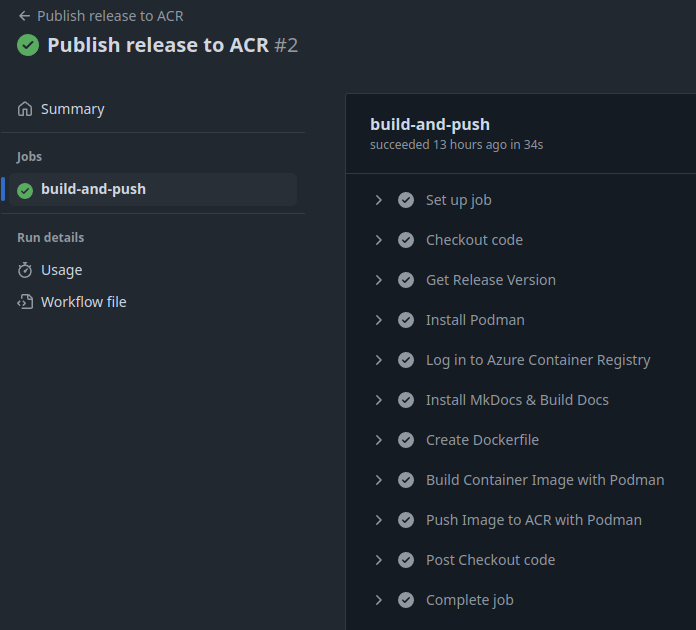

## 1. Despliegue de la infraestructura

1. Accede al directorio de terraform en el repositorio e inicializa terraform.

    ```sh
    cd terraform
    terraform init
    ```
    Output: `Terraform has been successfully initialized!`

2. Ejecuta la validación de los ficheros generados con el siguiente comando:

    ```sh
    terraform validate
    ```
    output: `Success! The configuration is valid.`

3. Despliega la infraestructura

    ```sh
    terraform apply --auto-approve
    ```

## 2. Publicación de la imagen

La publicación de la imagen se realiza mediante el action [Publish release to ACR](https://github.com/charlstown/unir-cp2/actions/workflows/publish-release.yml) en el mismo repositorio de github.

1. Rellenar los datos del formulario del workflow con username y pwd del ACR desplegado en Azure.

    

2. Ejecutar workflow y validar la correcta ejecución del job

    

## 3. Configuración de VM con ansible

1. Comprobar conexión a la VM por SSH

    ```sh
    ssh -i ~/.ssh/az_unir_rsa azureuser@<YOUR_VM_PUBLIC_IP>
    exit
    ```

2. Exportar secrets en el environment

    ```sh
    export ACR_USERNAME="your_acr_username"
    export ACR_PASSWORD="your_acr_password"
    ```

3. Ejecutar ansible apuntando a la VM

    ```sh
    ansible-playbook -i inventory.ini install_podman_run_container.yml --extra-vars "@vars.yml"
    ```

4. Comprobar que el contenedor está ejecutándose

    ```sh
    ssh -i ~/.ssh/az_unir_rsa azureuser@<YOUR_VM_PUBLIC_IP>
    podman ps
    ```